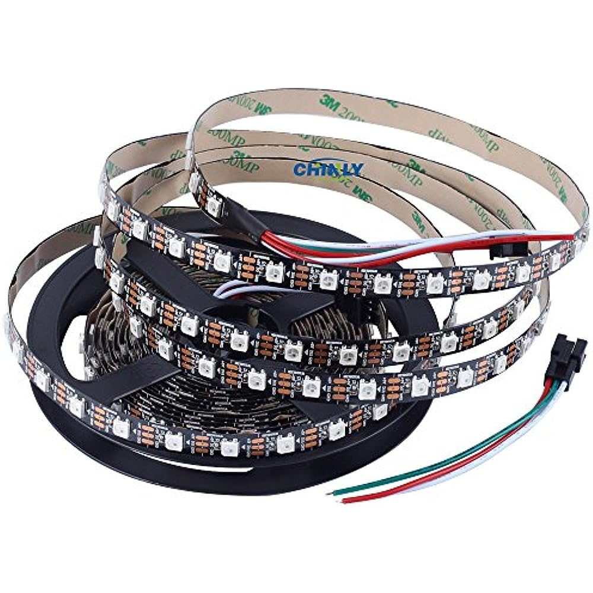
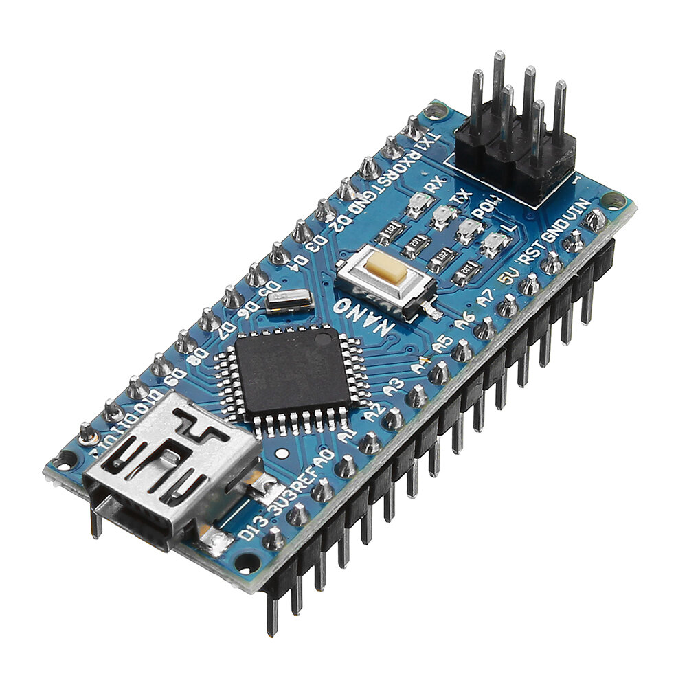
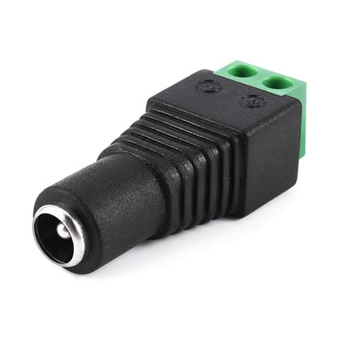
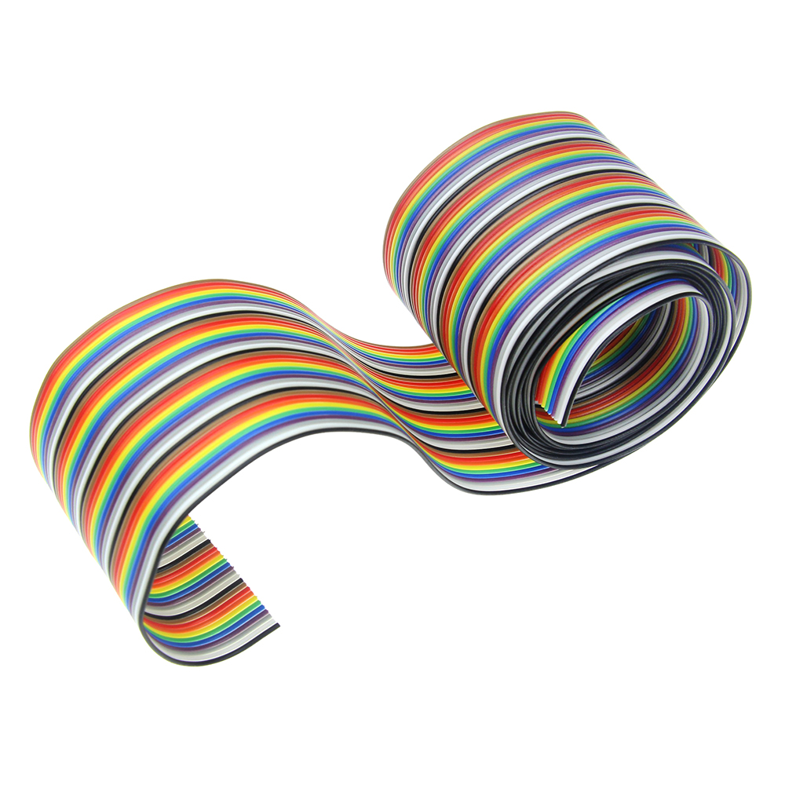
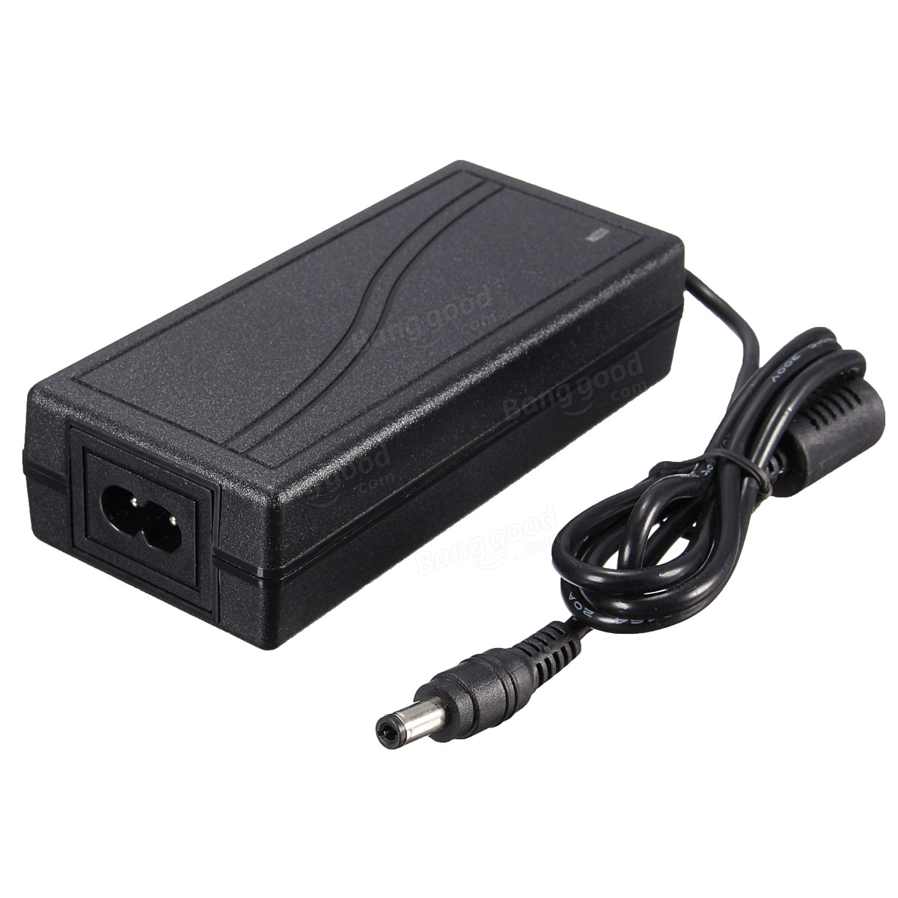
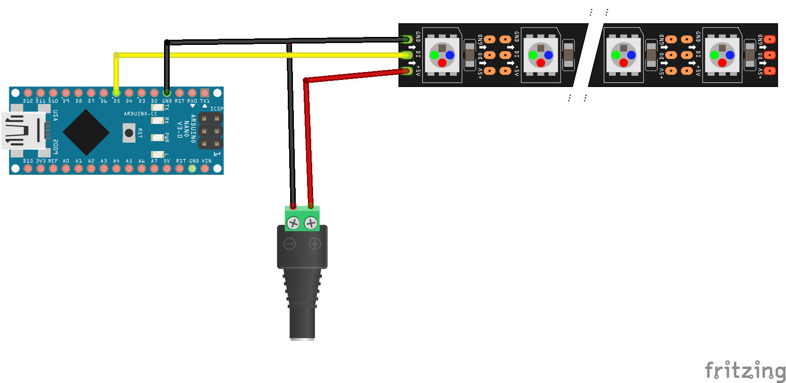
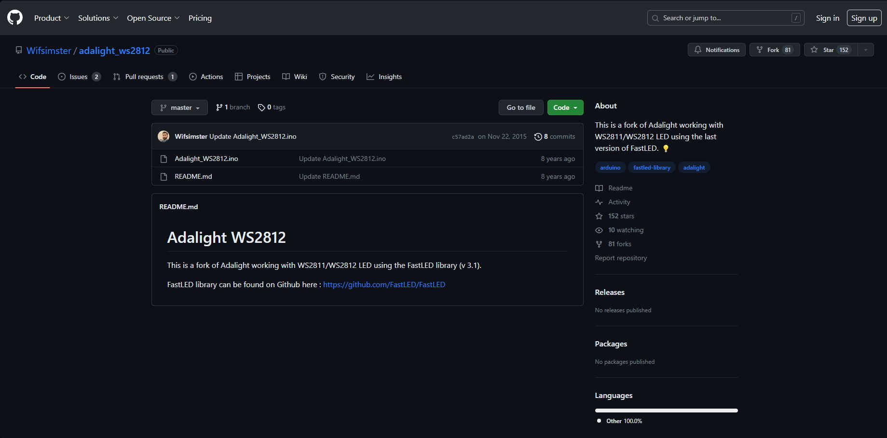
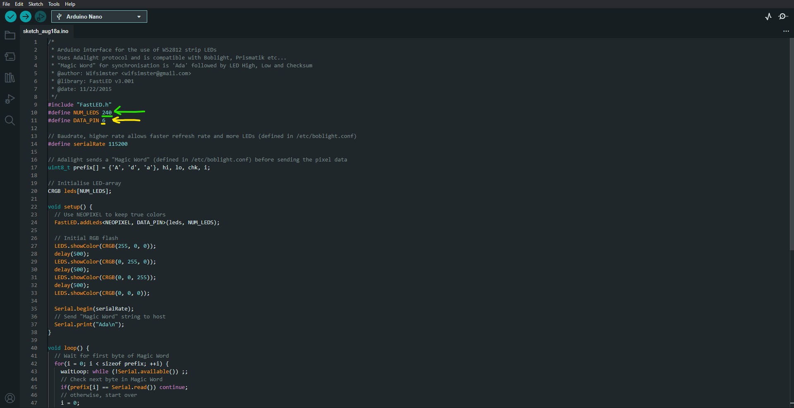

# AmbiLight with an Arduino Nano

## Required Hardware

- WS2812 5V Led strip (60leds/meter)

- Arduino Nano (or other microcontroller, Nano is the best option)

- Female connector

- 3 Cables

- 5V Power supply, the maximum wattage needs to be chosen based on the lenght of strip and the wattage for meter

In my case i used 60leds/meter for a absoption of 18W/m for a total of 2.5 meter, so 18*2.5 = 45W, so i needed a 10A power supply (45W/5V = 9A)

## Schematic

## Arduino Program

- Download Adalight WS2812 from github page : https://github.com/Wifsimster/adalight_ws2812

- Open the code in Arduino IDE
- Edit the parameters to be compiant to your schematic

- Upload to Arduino selecting "Nano" and the right COM port

## PC setup
